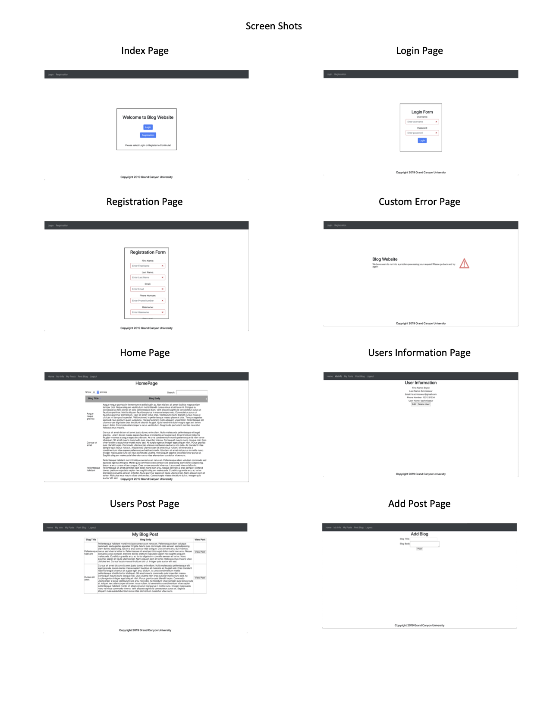

# BlogWebsiteSpring

For this project the objective was to create a website to have the ability to perform CRUD actions on. My partner and I decided to do a blog application where the user could create, read, update, and detroy the blogs. To implement this applcaition we started with using java as the base language and then leveraged the Spring Framework to be able to utilize the featrues it provided for java web development.

<h3>Technologies Used:</h3>
Java: Java SE 8 [1.8.0_221] 
IDE: Eclipse IDE for Enterprise Java Developers 2019-06 
Server: Tomcat v8.5 Server 

<h3>Features:</h3>
Throughout this project there was many features added to make the application more secure or even more efficent. The project contains a custom error page that will be displayed in order to hide our technologies being used. We implemented logging through AOP using a tracer class to intercept all the calls being made to method so we can log were the user is when there is an applciation. The implementation of maven allowed for us to deploy this applcaiton to many clouds such as Heroku, Azure and AWS through auto-deployment and CI/CD. 
  
<h3>Documentation:</h3> 
Below attached are all the different UML and screen shots used for the project:

<h4>UML Class Diagram</h4>

	

<h4>ER Diagram</h4>

	

<h4>Flow Chart</h4>

	

<h4>Final Product</h4>

	

